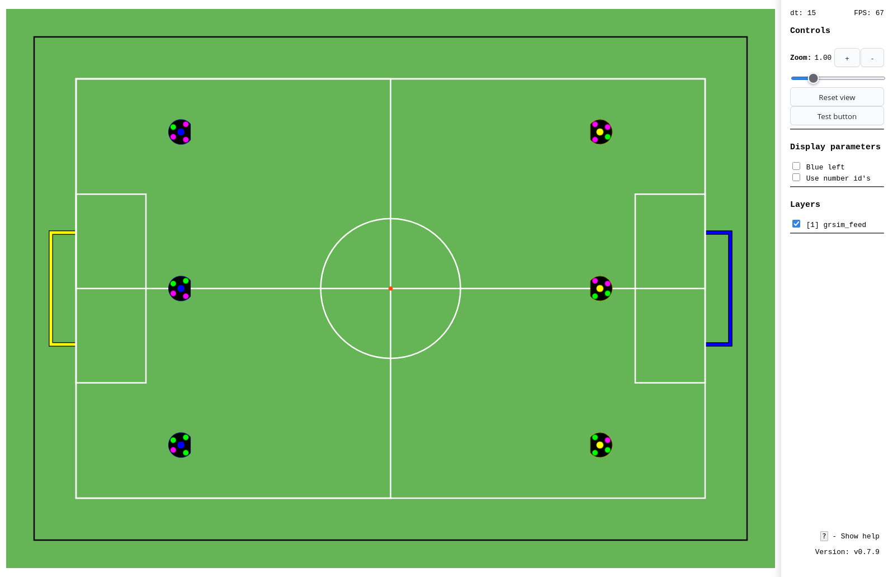

[](https://github.com/SPBUnited/serviz/actions/workflows/auto-semver.yml)

# SERVIZ - vizualisation server



Данный монорепозиторий содержит набор модулей новой структуры системы управления команды SPbUnited:

- SerViz (visualization server) - веб-интерфейс визуализации и управления стратегией
- LARCmaCS - сервис-интерфейс между стратегией и внешним миром (SSL-Vision, SSL-GameController, управление роботами)
- TelSink [WIP] - сервис управления логами и воспроизведения реплеев

Итоговая структура системы выглядит примерно так:

<!--  -->


## Мотивация

Данный проект создавался с целью упростить структуру системы управления роботами нашей команы для соревнований RoboCup SSL, а также для более простой и легкой настройки окружения разработчика для новых учеников, команд и при проведении мастер-классов по данной дисциплине.

Основная функция данного проекта - это замена существующего ныне решения для связи кода стратегии с системой компьютерного зрения и управления роботами LARCmaCS (читается как лармакс) на простое в развертывании решение с гибким веб-интерфейсом и API для автоматического тестирования.

В перспективе данная программа позволит сохранять логи игр и состояния стратегии, анализировать их вручную и автоматически, а также количественно оценивать качество игры и автоматически тестировать работу стратегии в заданных игровых сценариях (в данный момент инструментов для количественной оценки качества игры у нас нет). Помимо этого планируется использовать возможность программатически управлять запуском стратегии, логгированием и состоянием игры для создания фреймворка для обучения ML алгоритмов стратегии

## Реализованные функции

### CORE

- Связь между модулями через zmq (ipc)
- Автоматическая установка зависимостей, сборка и запуск сервисов

### LARCMACS

- Чтение состояния игрового поля
- Отправка команд управления в grsim
- Связь с кодом стратегии, использущим strategy-bridge через zmq
- Получение данных Vision Trackers из Autoreferee

### SERVIZ
- Отрисовка игрового поля с объектами на поле в реальном времени. Реализованные объекты:
    - [x] Роботы (с маркерами или номерами)
    - [x] Мяч
    - [x] Стрелки скорости
    - [x] Произвольные линии и стрелки
    - [ ] Кривые
    - [x] Точки
- Поддержка множества слоев с настройкой видимости для каждого слоя
- Возможность управления роботами через клавиатуру

## Документация

[Справка по формату межпроцессных сообщений](docs/zmq_api_v2.md)

## Зависимости

- Python 3.12
- Node.js 18
- Docker
- Docker Compose

## Установка и запуск

Склонируйте репозиторий:

```bash
git clone https://github.com/SPbUnited/serviz.git
cd serviz
```

Установите зависимости и соберите проект:

```bash
make init
make build
```

Запустите все сервисы:

```bash
make up-all
```

После запуска можно подключится к serviz по адресу http://localhost:8000

## Более подробное описание реализованных инструкций:

- `make init` - инициализирует виртуальное окружение и зависимости
- `make build` - собирает образы для serviz и larcmacs
- `make up` - запускает все сервисы кроме grsim
- `make up-grsim` - запускает headless grsim
- `make up-all` - запускает все сервисы (serviz, larcmacs, grsim)
- `make npm-dev` - запуск фронтенда Сервиза в режиме live-server для разработки
- `make down` - останавливает все сервисы
- `make purge` - очищает все сервисы и их данные

## Переключение дивизионов

По умолчанию Сервиз запускается с `divB`. Для смены настройки используемого дивизиона можно указать требуемый дивизион при запуске через `make`:

```bash
make up-all DIV='divB' # Для divB
make up-all DIV='divC' # Для divC
```

Эта настройка влияет на количество создаваемых роботов в симуляторе и на отображаемое поле в Сервизе.
