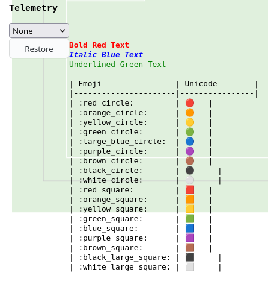

WIP (не поддерживаеся в данный момент)

# Справка API телеметрии

## Форматирование текста

Для форматирования текста можно использовать специальные html теги:

### Цвета

- `<r>` - <span style="color: red">красный</span> (`red`)
- `<o>` - <span style="color: orange">оранжевый</span> (`orange`)
- `<y>` - <span style="color: yellow">желтый</span> (`yellow`)
- `<g>` - <span style="color: green">зеленый</span> (`green`)
- `<b>` - <span style="color: blue">синий</span> (`blue`)
- `<p>` - <span style="color: purple">фиолетовый</span> (`purple`)
- `<k>` - <span style="color: black">черный</span> (`black`)
- `<w>` - <span style="color: white">белый</span> (`white`)
- `<c>` - <span style="color: cyan">циан</span> (`cyan`)
- `<m>` - <span style="color: magenta">пурпурный</span> (`magenta`)
- `<l>` - <span style="color: lime">светло-зеленый</span> (`lime`)
- `<a>` - <span style="color: aqua">аква</span> (`aqua`)
- `<n>` - <span style="color: navy">синий-синий</span> (`navy`)
- `<v>` - <span style="color: violet">ярко-фиолетовый</span> (`violet`)
- `<s>` - <span style="color: silver">серебро</span> (`silver`)

### Курсив, жирность и подчеркивание

- `<x>` - <span style="font-weight: bold">жирный</span> (`bold`)
- `<i>` - <span style="font-style: italic">курсив</span> (`italic`)
- `<u>` - <span style="text-decoration: underline">подчеркнутый</span> (`underline`)
- `<q>` - <span style="text-decoration: line-through">зачеркнутый</span> (`line-through`)


## Пример

Такое сообщение телеметрии даст то, что отображается на картинке.

```
<x><r>Bold Red Text</r></x>
<i><b>Italic Blue Text</b></i>
<u><g>Underlined Green Text</g></u>

| Emoji                | Unicode        |
|----------------------|----------------|
| :red_circle:         | &#x0001f534;   |
| :orange_circle:      | &#x0001f7e0;   |
| :yellow_circle:      | &#x0001f7e1;   |
| :green_circle:       | &#x0001f7e2;   |
| :large_blue_circle:  | &#x0001f535;   |
| :purple_circle:      | &#x0001f7e3;   |
| :brown_circle:       | &#x0001f7e4;   |
| :black_circle:       | &#x0026ab;     |
| :white_circle:       | &#x0026aa;     |
| :red_square:         | &#x0001f7e5;   |
| :orange_square:      | &#x0001f7e7;   |
| :yellow_square:      | &#x0001f7e8;   |
| :green_square:       | &#x0001f7e9;   |
| :blue_square:        | &#x0001f7e6;   |
| :purple_square:      | &#x0001f7ea;   |
| :brown_square:       | &#x0001f7eb;   |
| :black_large_square: | &#x002b1b;     |
| :white_large_square: | &#x002b1c;     |
```

